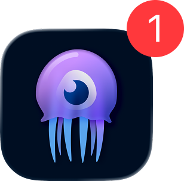

<div align="center">
    <h1>SeerrAPN</h1>
    
</div>

SeerrAPN is an [APN](https://d.lumaa.fr/AosqMi) (Apple Push Notification) service using [Seerr](https://github.com/seerr-team/seerr)'s webhooks.

## Features

### Events supported

- New Request
- Request Denied
- Movie/Show Available
- Request Automatically Approved

### Filters

You can make it so that users have only specific notifications:

- None: `0`
- New Request: `1`
- Request Denied: `2`
- Movie/Show Available: `4`
- Request Automatically Approved: `8`

To filter multiple notifications, simply add the number matching the notification like so:
```
- Request Denied: 2
- Request Automatically Approved: 8

2 + 8 = 10
```

You cannot filter out the `TEST_NOTIFICATION`, accessible by a Seerr administrator.

## Running

To make SeerrAPN work follow these steps:

1. Rename the `EXAMPLE.env` file to `.env` file
2. Generate an APN [Certificate](https://developer.apple.com/account/resources/certificates/list)
3. Change the `.env` file to your wish
4. Run `node server/index.js` or use Docker Compose with `docker-compose.yml`
5. Set the Seerr webhook URL as `http://localhost:3000/apn` (or with your chosen port/URL) and fill in the _Authorization Header_ with the one you chose

## Subscribe using [Swiftseerr](https://d.lumaa.fr/swiftseerr)

If you have a running SeerrAPN instance, or if you administrator set up one. You can subscribe to the Seerr notifications using the steps below:

_Requirements_:

- An iOS device running [Swiftseerr](https://d.lumaa.fr/swiftseerr)
- The _SeerrAPN URL_ for your [Seerr](https://github.com/seerr-team/seerr) instance and the _Authorization Header_

1. Allow notifications in the Settings app for Swiftseerr
2. Tap the settings icon in the top right corner, and select "_Notifications_"
3. Type the _SeerrAPN URL_ in the text field with the same name and the _Authorization Header_ in the text field below
4. Tap the purple paperplane button

If the informations written are invalid, or if the SeerrAPN instance has issues, an error on-screen should appear.

---

© Lumaa 2025
